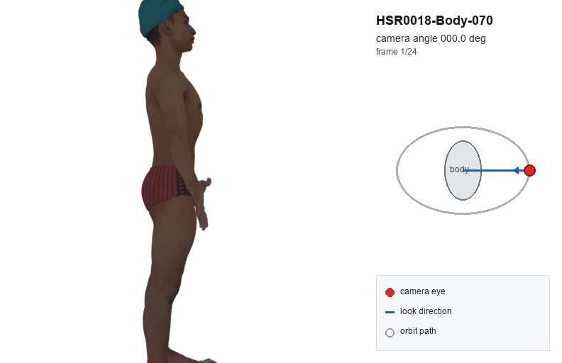
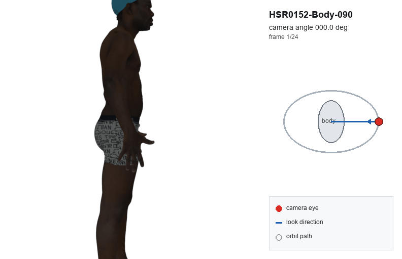
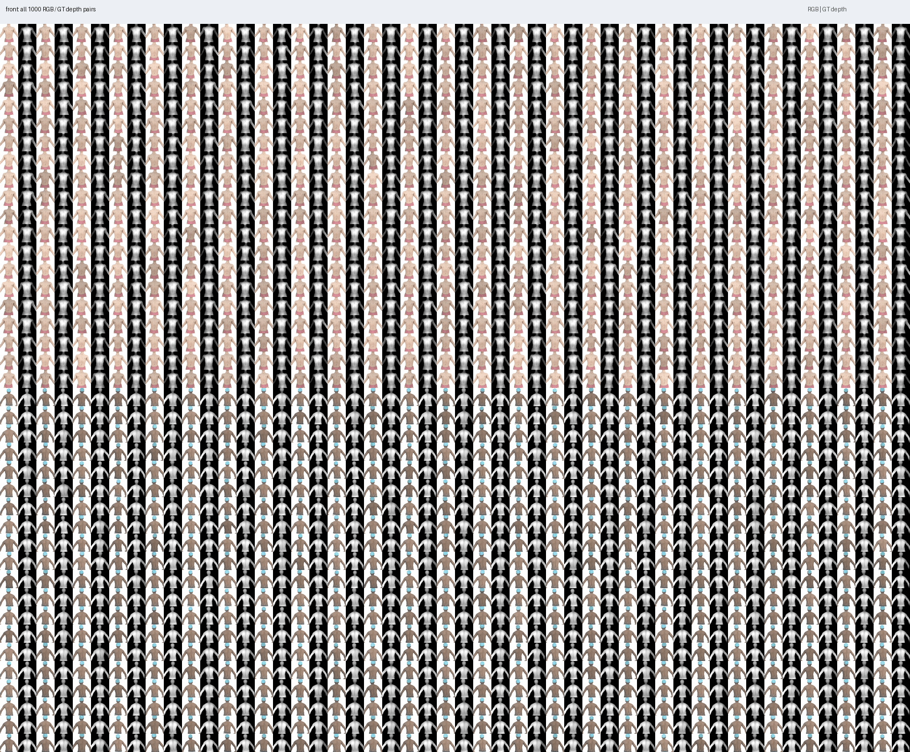
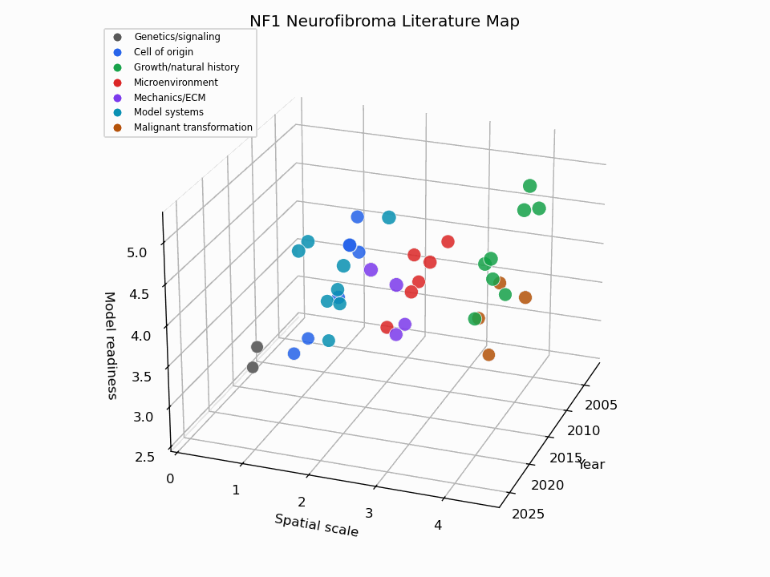

# Synthetic Neurofibroma

Synthetic neurofibroma data-generation and depth-estimation experiments for
HSR body scans. The repo contains project code, small public preview assets,
literature notes, and documentation for generated local datasets.

The large generated datasets, raw scans, rendered notebooks, meshes, arrays,
and model outputs are intentionally kept local under `data/` and are ignored by
normal Git commits.

## Preview

HSR textured scan turntables:





Back gaussian-interpolation RGB/depth montage:


Synthetic RGB/depth review montage:



Literature map preview:



## Research Plan

The current research plan is included here:

[Alex-Dils_Research-Plan_06222026.docx](Alex-Dils_Research-Plan_06222026.docx)

## Related Repository

3D segmentation work is tracked separately in
[axel-slid/3D-seg](https://github.com/axel-slid/3D-seg).

## Getting Started

Clone the repository:

```bash
git clone git@github.com:axel-slid/synthetic_neurofibroma.git
cd synthetic_neurofibroma
```

Create or activate a Python environment, then install the lightweight project
helpers in editable mode:

```bash
python -m pip install -e .
```

Large inputs and generated outputs are expected to exist locally under `data/`.
They are not bundled with the public repo. See [data/README.md](data/README.md)
for the dataset layout contract.

## Repository Layout

```text
synthetic_neurofibroma/
  code/
    synthetic_nf/           Shared project helpers for paths and dataset structure
    data_generation/        Project scripts for generating and visualizing synthetic lesions
    depth_maps/             Scripts for generating base HSR RGB/depth pairs and plots
    depth_maps/depth_pro/   Depth Pro runners, prediction scripts, and fine-tuning scripts
    external/               Third-party or collaborator GitHub/code drops
  data/
    depth_maps/             Generated RGB/depth examples, manifests, and plots
    hsr/                    HSR scan inputs and HSR mesh/Plotly visualizations
    predictions/            Model prediction/fine-tuning outputs
    skin/                   Fitzpatrick neurofibromatosis images and manifest
    synthetic/              Synthetic single- and multiple-lesion datasets
    README.md               Dataset layout contract
  AGENTS.md                 Project-specific agent/data-folder rules
```

## Naming Conventions

Use lowercase snake case for project-owned code and data folders:

```text
code/depth_maps/
code/data_generation/sphere_generations/
data/synthetic/single_lesion/body_parts/back/spheres_diffusion/
```

Use this convention for external GitHub repositories or other people’s code:

```text
code/external/<repo_owner>__<repo_name>/
```

Examples:

```text
code/external/apple__ml-depth-pro/
code/external/DepthAnything__Depth-Anything-V2/
code/external/facebookresearch__sam2/
```

If the code is not from a clean GitHub owner/repo source, use a clear folder name under `code/external/`, and add a README inside that folder describing where it came from.

## Current Main Components

### HSR Processing

HSR scan processing scripts are in:

```text
code/data_generation/hsr/scripts/
```

Generated HSR visualizations are in:

```text
data/hsr/visualizations/
```

### Synthetic Lesion Generation

Sphere and gaussian synthetic lesion scripts are in:

```text
code/data_generation/sphere_generations/scripts/
code/data_generation/gaussian_generations/scripts/
```

Generated datasets are in:

```text
data/synthetic/single_lesion/body_parts/<body_part>/<method>/
data/synthetic/multiple_lesion/body_parts/<body_part>/<method>/
```

The current body parts are `front`, `back`, `face`, `arms`, `hands`, `legs`,
and `feet`. Each body part contains these method folders:

```text
gaussian/
gaussian_interpolation/
gaussian_diffusion/
spheres/
spheres_interpolation/
spheres_diffusion/
physics_aug_growth/
```

Each method folder stores 1000 generated settings plus review outputs:

```text
data/synthetic/<single_lesion|multiple_lesion>/body_parts/<body_part>/<method>/
  data/settings.csv
  data/camera_depth_manifest.csv
  data/images/*_rgb.png
  data/depth/*_depth.npy
  data/depth/*_depth_mm.png
  data/depth_vis/*_depth_vis.png
  data/volumes/*_lesion_volume.ply
  summary.json
  visualization/plotly/<method>_closed_body_lesion_viewer.ipynb
  visualization/gifs/<method>_rgb_depth_preview.gif
```

The Plotly notebook is an executed HSR-style combined dropdown viewer. It uses
the filled closed-body HSR mesh, the baked-color sample overlay, and filled
lesion volume meshes in that body-part region. `camera_depth_manifest.csv`
indexes the 1000 RGB/depth-map pairs in the method folder.

Do not add split-level synthetic visualization folders. Legacy method-first
outputs from before the body-part restructure are archived under
`data/synthetic/_legacy_pre_bodypart_restructure/`.

### Depth Maps

Depth-map generation and plot update scripts are in:

```text
code/depth_maps/scripts/
```

Existing legacy generated depth outputs are in:

```text
data/depth_maps/base/
data/depth_maps/base/images/images/
data/depth_maps/base/images/depth/
data/depth_maps/base/images/depth_vis/
data/depth_maps/base/images/metadata/
data/depth_maps/base/plots/
```

`data/depth_maps/base/manifest.csv` stores paths relative to `data/depth_maps/base`.

New depth-map datasets should use:

```text
data/depth_maps/<dataset_name>/
  data/
  visualizations/
```

### Depth Pro

Depth Pro scripts are in:

```text
code/depth_maps/depth_pro/scripts/run_depth_pro.py
code/depth_maps/depth_pro/scripts/generate_base_depth_pro_predictions.py
code/depth_maps/depth_pro/scripts/finetune_depth_pro_on_depth_maps.py
```

Run Depth Pro on one image:

```bash
python code/depth_maps/depth_pro/scripts/run_depth_pro.py path/to/image.jpg
```

Depth Pro outputs go under `data/predictions/`:

```text
data/predictions/depth_pro_single/
data/predictions/depth_pro_base/
data/predictions/depth_pro_finetuned_synthetic/
```

The executed Fitzpatrick Plotly notebook and its cached assets live with the
Fitzpatrick dataset:

```text
data/skin/fitzpatrick/visualizations/depth_pro/plotly/plot_fitzpatrick_depth_surfaces.ipynb
```

## Data Folder Rules

For new generated datasets, use this pattern:

```text
data/<area>/<dataset_name>/
  data/              Machine-readable data, meshes, arrays, manifests, metadata
  visualizations/    GIFs, notebooks, Plotly outputs, previews
  summary.json        Dataset-level run summary, when useful
```

Project rule from `AGENTS.md`: visualization folders should not use HTML-only outputs as the main deliverable. Prefer GIFs and executed `.ipynb` notebooks with Plotly figures for interactive 3D data.

Some older generated folders still use direct `metadata/`, `images/`, or `plots/`
folders. Migrate those only when the corresponding manifests and scripts are
updated together.

## External Code Policy

Put imported third-party or collaborator code under:

```text
code/external/
```

For every external code folder, keep a small README with:

- Source URL or person/project source
- Commit hash or download date, if available
- Install instructions
- Any local modifications
- Whether outputs from that code should be stored in this repo or regenerated elsewhere

Do not mix external source files into project-owned script folders unless they have been deliberately adapted.

## Common Commands

Compile the core project scripts after edits:

```bash
python -m py_compile \
  code/synthetic_nf/paths.py \
  code/synthetic_nf/datasets.py \
  code/depth_maps/depth_pro/scripts/run_depth_pro.py \
  code/depth_maps/depth_pro/scripts/generate_base_depth_pro_predictions.py \
  code/depth_maps/scripts/generate_base_depth_maps.py \
  code/depth_maps/scripts/update_depth_visualizations.py
```

List the current high-level local tree:

```bash
find code data -maxdepth 2 -type d | sort
```

Check the Git-tracked public payload before pushing:

```bash
git status --short
git ls-files | sort
```

## Notes

Keep reusable source code under `code/`. Keep generated outputs, raw scans,
large notebooks, meshes, arrays, and model artifacts under `data/` unless there
is a specific reason to promote a small preview asset into `docs/assets/`.
